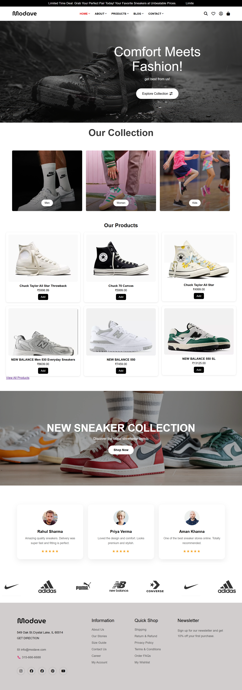
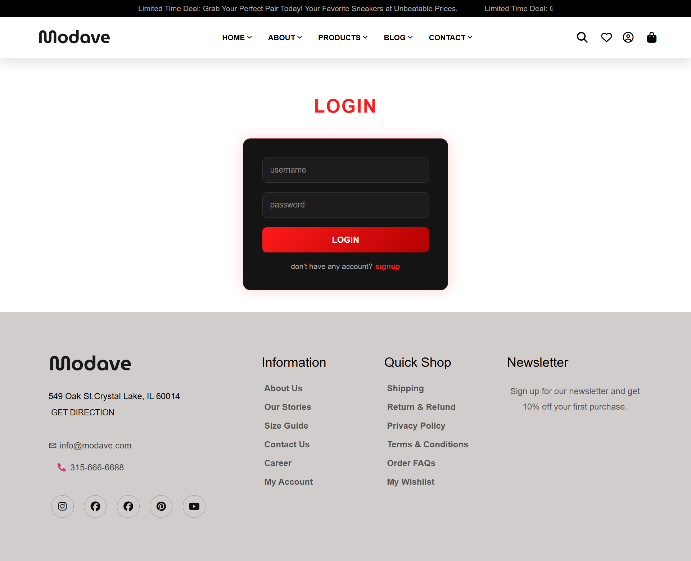
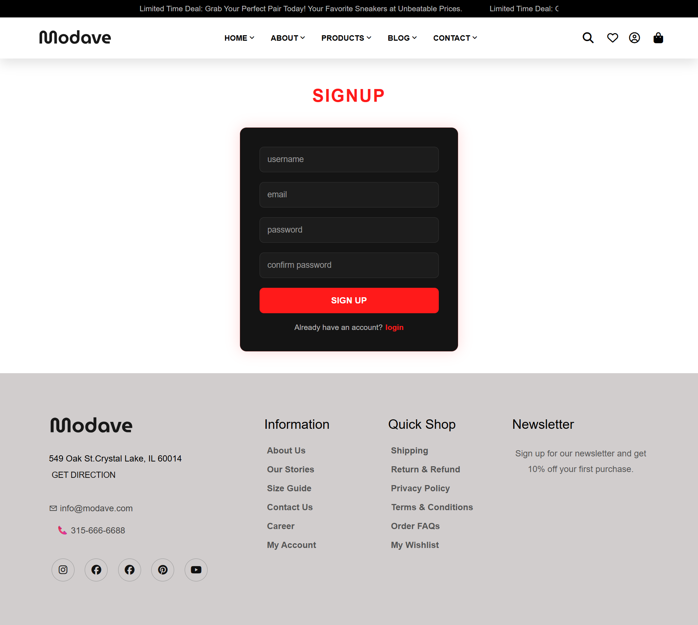

# 🛒 Django E-commerce Website

A modern full-stack e-commerce web application built using Django, HTML, CSS, JavaScript.

This project allows users to browse products, view product details, add items to cart, and experience a responsive shopping interface.

---

## 🚀 Features

- User Authentication (Login/Register)
- Product Listing Page
- Product Detail Page
- Add to Cart Functionality
- Responsive Design
- Category Filtering
- Search Functionality
- Admin Dashboard
- Multiple Product Images
- Size Selection
- Dynamic UI

---

## 🛠️ Tech Stack

### Frontend
- HTML
- CSS
- JavaScript

### Backend
- Python
- Django

### Tools
- Git
- GitHub
- VS Code

---

# Screenshots

## Homepage

## Product Page

## Cart Page

## login/signup page

